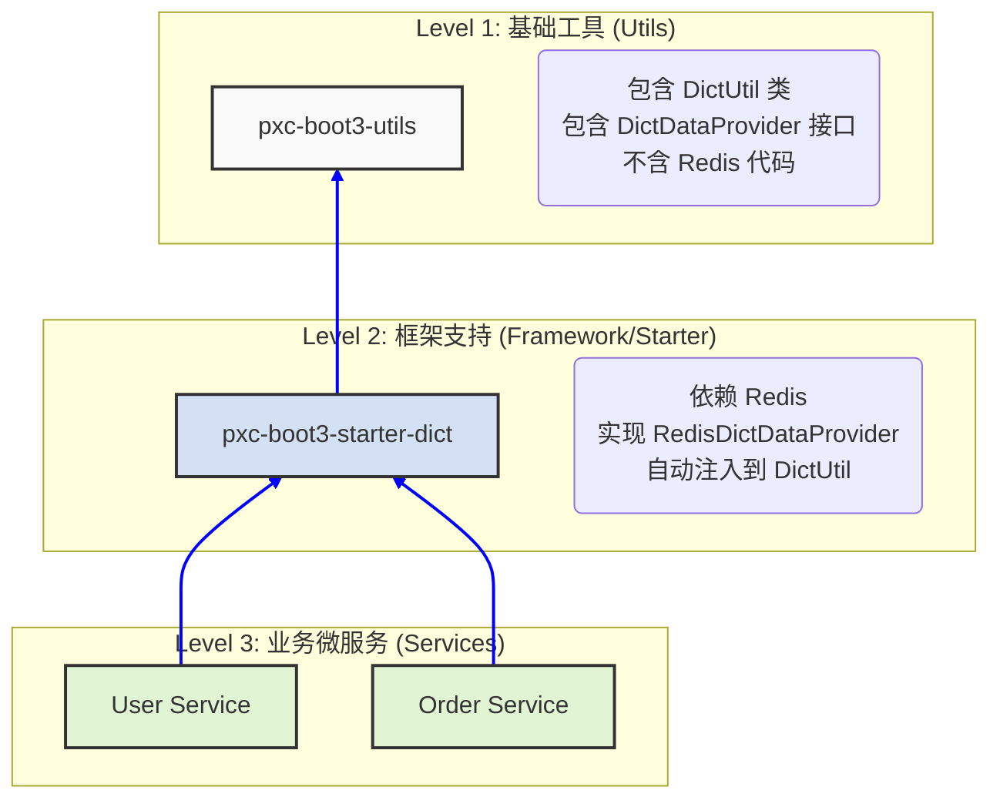

# pxc-framework-boot3-util

## 功能描述

pxc-framework-boot3-util 是一个基于 Spring Boot 3 的工具组件库，提供了一系列常用的工具类和方法，用于简化开发过程。

## 使用方法

### maven

```xml

<dependency>
    <groupId>io.github.panxiaochao</groupId>
    <artifactId>pxc-framework-boot3-util</artifactId>
    <version>${最新版本}</version>
</dependency>
```

或者

```xml
<!-- 父工程引入 -->
<dependencyManagement>
    <dependencies>
        <dependency>
            <groupId>io.github.panxiaochao</groupId>
            <artifactId>pxc-framework-boot3-bom</artifactId>
            <version>${最新版本}</version>
            <type>pom</type>
            <scope>import</scope>
        </dependency>
    </dependencies>
</dependencyManagement>
```

相关工程引入

```xml
<!-- 子工程引入 -->
<dependency>
    <groupId>io.github.panxiaochao</groupId>
    <artifactId>pxc-framework-boot3-util</artifactId>
</dependency>
```

## 注意事项

## Utils 工具类汇总

| 类名                                                                                                         | 说明                               |
|------------------------------------------------------------------------------------------------------------|----------------------------------|
| [ArithmeticUtil.java](src/main/java/io/github/panxiaochao/boot3/utils/ArithmeticUtil.java)            | 算术运算工具类，提供基本数学计算功能               |
| [ArrayUtil.java](src/main/java/io/github/panxiaochao/boot3/utils/ArrayUtil.java)                      | 数组操作工具类，提供数组相关操作方法               |
| [BooleanUtil.java](src/main/java/io/github/panxiaochao/boot3/utils/BooleanUtil.java)                  | 布尔值工具类，处理字符串与布尔值转换等              |
| [CharPools](src/main/java/io/github/panxiaochao/boot3/utils/CharPools.java)                           | 字符常量池工具类，提供常用字符常量                |
| [CharSequenceUtil.java](src/main/java/io/github/panxiaochao/boot3/utils/CharSequenceUtil.java)        | 字符序列工具类，提供字符串操作方法                |
| [CollectionUtil.java](src/main/java/io/github/panxiaochao/boot3/utils/CollectionUtil.java)            | 集合类工具，提供集合相关操作方法                 |
| [ConvertUtil.java](src/main/java/io/github/panxiaochao/boot3/utils/ConvertUtil.java)                  | 类型转换工具类，提供各种数据类型转换               |
| [CoordinateUtil.java](src/main/java/io/github/panxiaochao/boot3/utils/CoordinateUtil.java)            | 坐标工具类，处理坐标相关计算                   |
| [DateContext](src/main/java/io/github/panxiaochao/boot3/utils/date/DateContext.java)                  | 日期上下文工具类，处理日期时间相关操作              |
| [DatePattern](src/main/java/io/github/panxiaochao/boot3/utils/date/DatePattern.java)                  | 日期格式模式工具类，定义常用日期格式               |
| [DateUtil.java](src/main/java/io/github/panxiaochao/boot3/utils/date/DateUtil.java)                   | 日期工具类，提供日期时间相关操作                 |
| [DbMetaUtil.java](src/main/java/io/github/panxiaochao/boot3/utils/DbMetaUtil.java)                    | 数据库元数据工具类，用于获取数据库表结构信息           |
| [DiffCompareUtil.java](src/main/java/io/github/panxiaochao/boot3/utils/DiffCompareUtil.java)          | 差异比较工具类，用于文本或对象差异对比              |
| [DownLoadUtil.java](src/main/java/io/github/panxiaochao/boot3/utils/DownLoadUtil.java)                | 下载工具类，处理文件下载相关操作                 |
| [EmojisUtil.java](src/main/java/io/github/panxiaochao/boot3/utils/EmojisUtil.java)                    | 表情符号工具类，处理表情符号相关操作               |
| [ExceptionUtil.java](src/main/java/io/github/panxiaochao/boot3/utils/ExceptionUtil.java)              | 异常处理工具类，提供异常处理相关方法               |
| [IpUtil.java](src/main/java/io/github/panxiaochao/boot3/utils/IpUtil.java)                            | IP地址工具类，处理IP地址相关操作               |
| [JacksonUtil.java](src/main/java/io/github/panxiaochao/boot3/utils/JacksonUtil.java)                  | Jackson工具类，处理JSON序列化和反序列化        |
| [JdbcUtil.java](src/main/java/io/github/panxiaochao/boot3/utils/JdbcUtil.java)                        | JDBC工具类，提供数据库连接和操作相关方法           |
| [JdkUtil.java](src/main/java/io/github/panxiaochao/boot3/utils/JdkUtil.java)                          | JDK工具类，提供JDK相关操作                 |
| [LocalDateTimeUtil.java](src/main/java/io/github/panxiaochao/boot3/utils/date/LocalDateTimeUtil.java) | 本地日期时间工具类，处理Java 8时间API相关操作      |
| [MapUtil.java](src/main/java/io/github/panxiaochao/boot3/utils/MapUtil.java)                          | Map工具类，提供Map集合相关操作方法             |
| [NamingRuleUtil.java](src/main/java/io/github/panxiaochao/boot3/utils/NamingRuleUtil.java)            | 命名规则工具类，处理命名转换规则                 |
| [ObjectUtil.java](src/main/java/io/github/panxiaochao/boot3/utils/ObjectUtil.java)                    | 对象工具类，提供对象相关操作方法                 |
| [OkHttp3Util.java](src/main/java/io/github/panxiaochao/boot3/utils/OkHttp3Util.java)                  | OkHttp3工具类，基于OkHttp3的HTTP请求工具    |
| [PatternPools](src/main/java/io/github/panxiaochao/boot3/utils/PatternPools.java)                     | 正则表达式模式池，提供常用正则表达式模式             |
| [PropertiesUtil.java](src/main/java/io/github/panxiaochao/boot3/utils/PropertiesUtil.java)            | 属性文件工具类，处理properties配置文件         |
| [QRCodeUtil.java](src/main/java/io/github/panxiaochao/boot3/utils/QRCodeUtil.java)                    | 二维码工具类，生成和解析二维码                  |
| [RandomUtil.java](src/main/java/io/github/panxiaochao/boot3/utils/RandomUtil.java)                    | 随机数工具类，生成随机数和随机字符串               |
| [RegexPools](src/main/java/io/github/panxiaochao/boot3/utils/RegexPools.java)                         | 正则表达式池，提供常用正则表达式                 |
| [RegexUtil.java](src/main/java/io/github/panxiaochao/boot3/utils/RegexUtil.java)                      | 正则表达式工具类，提供正则匹配相关操作              |
| [RequestUtil.java](src/main/java/io/github/panxiaochao/boot3/utils/RequestUtil.java)                  | 请求工具类，处理Web请求相关操作                |
| [ResourceUtil.java](src/main/java/io/github/panxiaochao/boot3/utils/ResourceUtil.java)                | 资源工具类，处理资源文件相关操作                 |
| [RestTemplateUtil.java](src/main/java/io/github/panxiaochao/boot3/utils/RestTemplateUtil.java)        | RestTemplate工具类，Spring REST客户端工具 |
| [SerializationUtil.java](src/main/java/io/github/panxiaochao/boot3/utils/SerializationUtil.java)      | 序列化工具类，处理对象序列化和反序列化              |
| [Singleton](src/main/java/io/github/panxiaochao/boot3/utils/Singleton.java)                           | 单例工具类，提供单例模式相关实现                 |
| [SnowFlakeUtil.java](src/main/java/io/github/panxiaochao/boot3/utils/SnowFlakeUtil.java)              | 雪花算法工具类，生成分布式唯一ID                |
| [SpringContextUtil.java](src/main/java/io/github/panxiaochao/boot3/utils/SpringContextUtil.java)      | Spring上下文工具类，获取Spring容器中的Bean    |
| [StrUtil.java](src/main/java/io/github/panxiaochao/boot3/utils/StrUtil.java)                          | 字符串工具类，提供丰富的字符串操作方法              |
| [StringPools](src/main/java/io/github/panxiaochao/boot3/utils/StringPools.java)                       | 字符串常量池，提供常用字符串常量                 |
| [SystemServerUtil.java](src/main/java/io/github/panxiaochao/boot3/utils/SystemServerUtil.java)        | 系统服务工具类，获取系统服务相关信息               |
| [UuidUtil.java](src/main/java/io/github/panxiaochao/boot3/utils/UuidUtil.java)                        | UUID工具类，生成通用唯一标识符                |
| [XssUtil.java](src/main/java/io/github/panxiaochao/boot3/utils/XssUtil.java)                          | XSS防护工具类，防止跨站脚本攻击                |

## Dict 字典设计模式

